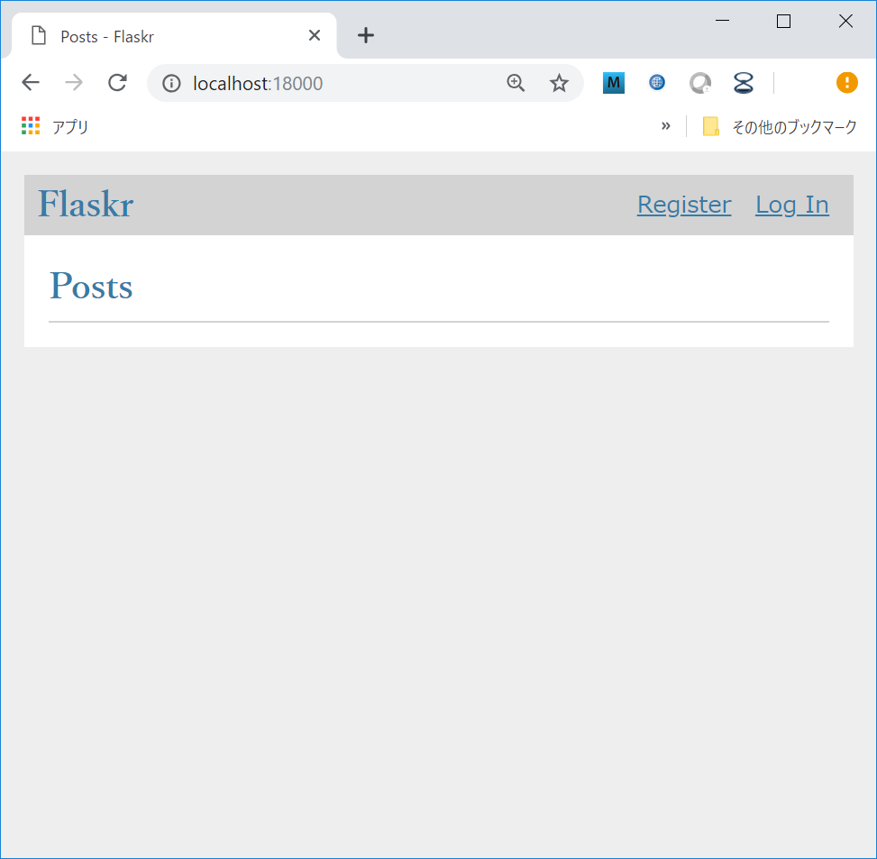
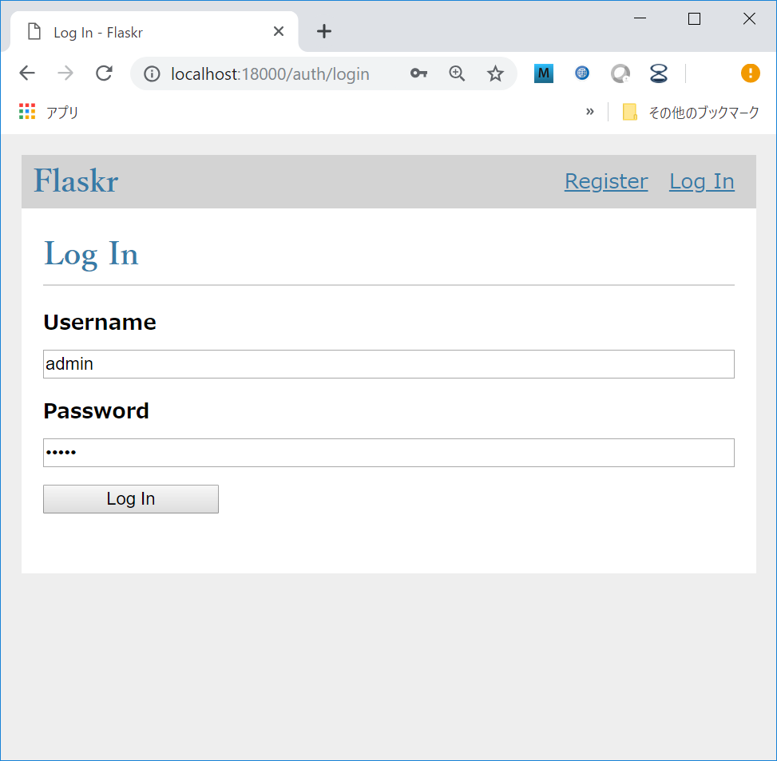
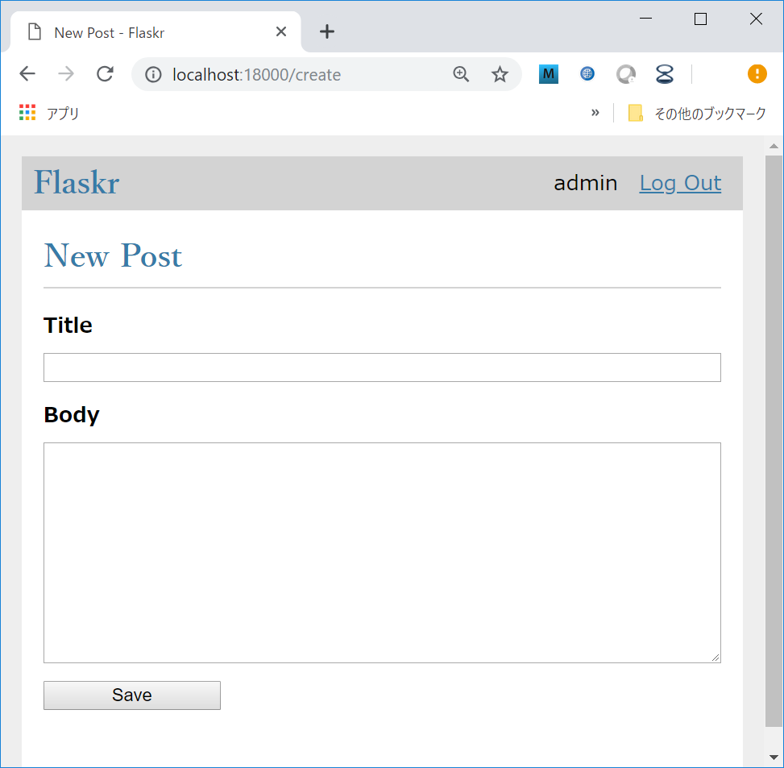

# flaskr

## setup flaskr

```
$ mkvirtualenv --python=/usr/bin/python3.6 flaskr
$ pip install flask
$ git clone git@github.com:dandan611/PhelenSimulator.git
```

## run flaskr

```
$ cd PhelenSimulater/00_FeasibilityStudy/02_flaskr
$ export FLASK_APP=flaskr
$ export FLASK_ENV=development
$ flask init-db
$ flask run --host=0.0.0.0 --port=8000
```

### POST



### Login 



### New Post



## application model

* Todo

## how to add feature

* Todo

